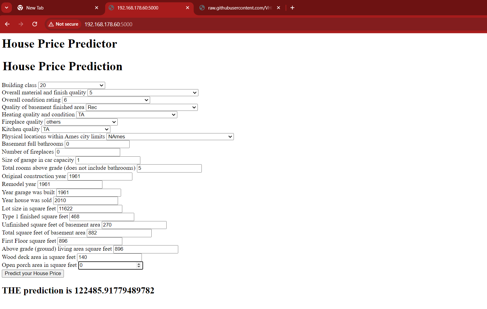

# Real_Estate_Price_Predictor_Web_App
## Overview
This repository contains the code file for the Real Estate price predictor app  presented during the summer semester 2024 for the course of Advanced Programming in THD Cham Campus.

The presentation covers the prediction of House price using various regression algorithms with numerous feature transforamtion and feature selection techniques. The modular coding approach is being implemented using python

---
# **Detailed Description**

## Data:

- The dataset is previously stored in amazon S3 and it is ingested from S3 using boto3 library with access and security keys.
- The dataset set has 81 columns and 1460 rows with dependent variable as 'Sale Price' which needs to be predicted.

## Exploratory Data Analysis:
 - Understanding the missing values for categorical and numerical features
 - Relationship between null values and dependent variable 'SalesPrice'
 - Finding the unique values in feature with numerical value
 - Breaking down variables with numerical values as discrete and categorical
 - Finidng the realtionship between discrete features and Sale Price
 - Analyse the continuous values by creating histograms to understand the distribution
 - Finding the correlation between the features
 - Checking for Outliers
 - Finding the number of categorical variable and relation between Sale Price

 ## Feature Engineering
 - Replace missing value with a new label called missing as the missing values are not missing by random manner
 - Replacing the numerical Missing Values using median
 - Handling Date Time Variables
 - We use Log transform on continous variables
 - Handling Rare Categorical values
 - Encoding for the ordinal categorical feature (Target Guided Encoding)
 - Encoding for the nominal categorical variable (Mean Encoding)
 - Removing the outliers

 ## Feature Selection
 - Lasso feature selection is preferred over Mutual Information gain feature selection.

 ## Model Training
 - Test Train Split is performed
 - Feature Scaling is performed using MInMax Scaler
 - Linear Regression, Polynomial Regression, Support Vector Regression, Decison tree, Randomn Forrest, AdaBoost Regressor,Gradient Boosting Regressor and XGBRegressor are the algorithm are used and their performance are evaluated.
 - Hyper parameter Tuning is performed on the best performing models.
 - The best model is chosen.

 ## Performance Metrics
 - The model are evaluated using Adjusted R2 and R2 score and Mean square error is also considered
 - Inferring the Adjusted R2 score and R2 score the hyper parameterised Randomn forrest regressor peforms really well.

 ## Web App:
 - The web app is built using python flask and GET and POST commands are used to get the input from the consumer and output predicted price to the webpage.

---
# Installation Instructions

- Install the Anaconda IDE <https://www.anaconda.com/download>

 ---

 # Plugins and Libraies Used
  - Python Version - 3.12.4
  - VS Code for Windows
  - Jupyter Notebook
  - GitHub for Windows
  - Git for Windows
  - Pandas
  - Numpy
  - seaborn
  - Matploib
  - pylab
  - scklearn
---
# Coding Practises Followed
- The variables are given meaningful names which truly represent the context of the problem
- Clear and explainable comments are added 
- The variable name follow the **Snake Case** naming convention.
- Following is the below code example for the practises followed
---
# Results

# Authors
 - [VHkrishnan0591](https://github.com/VHkrishnan0591)